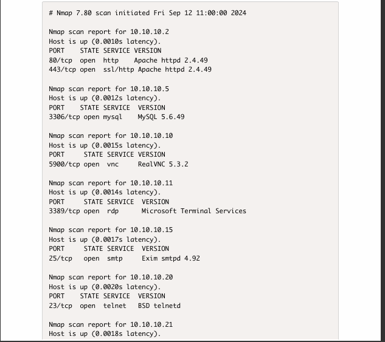

# REPORT ON PENERATION TESTING
* [Internal Network Penetration Testing Introduction](#introduction)
* [Scope](#scope)
* [Host Discovery](#host-discovery)
* [Service Discovery And Port Scanning](#service-discovery-and-port-scanning)
* [Vulnerability Scanning](#vulnerability-scanning)
* [Web-Based Attack Surfaces](#web-based-attack-surfaces)
* [Generating Payloads](generating-payloads)

For:VITUAL INFOSEC AFRICA

Submitted by: 
DOMINIC KOJO KUDAWOO 

https://securetrust.io

#### Executive Summary 

 performed an internal and external penetration test of in
 scope items provided by Sample Company from 2nd september, 2024, through september 27th, 2023. 
This report describes penetration testing that represents a point-in-time snapshot of the 
network security posture of the scope in question, which can be found in the following section.

The primary objective of this testing was to assess the security posture of our internal systems, identify vulnerabilities, and evaluate the effectiveness of existing security controls.

The testing focused on critical internal assets, including servers, workstations, databases, and applications. The assessment involved both automated scanning tools and manual testing techniques to uncover potential security weaknesses.Several high-risk vulnerabilities were detected, including unpatched software, misconfigured devices, and weak password policies. Specific instances include:

Outdated operating systems with known exploits.

#### Analysis of Overall Security Posture

The overall risk to Sample Company from an internal perspective is HIGH. he internal network penetration testing conducted recently aimed to evaluate the security measures protecting our internal systems and data. This analysis provides an overview of the organization’s security posture based on the findings from the testing, highlighting strengths, weaknesses, and areas for improvement.
 The testing revealed a significant number of unpatched systems and outdated software. A lack of effective vulnerability management practices increases the risk of exploitation by attackers.
 
#### Key Recommendations: 

1. Audit and decrease user permissions across the network.
 
2.  Regularly assess and update all software and systems to address known vulnerabilities.
 
3. Prioritize patching based on the severity of vulnerabilities and potential impact.
4. Implement a systematic process for identifying, prioritizing, and remediating vulnerabilities.

### Host Discovery

 Scope
 The scope of engagement comprises of an internal network: 
name: 
https://virtualinfosecafrica.com/
 
 10.10.10.0/24 and a domain; Virtual InfoSec Africa.
 An nmap scan was performed to identify the hosts thaat were up and the potential vulnerabilities.
 
 
 
 If the hosts appear to be down even when they're up, the following comman can be used to identify them.
 
 

 The services discovered was sorted out using the following grep command.

 

 The hosts and services discovered was sorted into a .txt file using;
 
 ## Service Discovery And Port Scanning  
In an internal network, services on devices connected to this network can be differenciated from each other due to their assigned port numbers.  
We scan ports to find out the services they are running.  
(https://github.com/daffum3/internal-network-pentesting/blob/main/Portscanning3.png)

2. Separate the output of the results into their respective protocols  
(https://github.com/daffum3/internal-network-pentesting/blob/main/protocols_operation.png)

## VULNERABILITY SCANNING 

After the above services, were discovered, the associated vulnerabilities were also identified as follows;

| SERVICE VERSIONS | VULNERABILITIES: EXPLOITDB | VULNERABILITIES: MITRE CVE|
|--------------------------------------------|----------------------------|---------------------------|
| http apache httpd 2.4.49                   | ------------ |(https://www.cve.org/CVERecord?id=CVE-2021-42013).    It was found that the fix for CVE-2021-41773 in Apache HTTP Server 2.4.50 was insufficient. An attacker could use a path traversal attack to map URLs to files outside the directories configured by Alias-like directives.
| ssl/http apache httpd 2.4.49               | ------------ |(https://www.cve.org/CVERecord?id=CVE-2021-34798).  Malformed requests may cause the server to dereference a NULL pointer. This issue affects Apache HTTP Server 2.4.48 and earlier.
| mysql MySQL 5.6.49                         | ------------ |(https://www.cve.org/CVERecord?id=CVE-2020-14867)   Difficult to exploit vulnerability allows high privileged attacker with network access via multiple protocols to compromise MySQL Server. Successful attacks of this vulnerability can result in unauthorized ability to cause a hang or frequently repeatable crash (complete DOS) of MySQL Server.
| vnc RealVNC 5.3.2                          | ------------ |(https://www.cve.org/CVERecord?id=CVE-2022-41975) . RealVNC VNC Server before 6.11.0 and VNC Viewer before 6.22.826 on Windows allow local privilege escalation via MSI installer Repair mode.
| rdp Microsoft Terminal Services            | ------------ |(https://www.cve.org/CVERecord?id=CVE-2014-0296).  The Remote Desktop Protocol (RDP) implementation in Microsoft Windows 7 SP1, Windows 8, Windows 8.1, and Windows Server 2012 Gold and R2 does not properly encrypt sessions, which makes it easier for man-in-the-middle attackers to obtain sensitive information by sniffing the network or modify session content by sending crafted RDP packets, aka "RDP MAC Vulnerability."
| smtp Exim smtpd 4.92                       | ------------ |(https://www.cve.org/CVERecord?id=CVE-2023-51766).  Exim before 4.97.1 allows SMTP smuggling in certain PIPELINING/CHUNKING configurations. Remote attackers can use a published exploitation technique to inject e-mail messages with a spoofed MAIL FROM address, allowing bypass of an SPF protection mechanism. This occurs because Exim supports <LF>.<CR><LF> but some other popular e-mail servers do not.
| telnet BSD telnetd                         | https://www.exploit-db.com/exploits/21018  https://www.exploit-db.com/exploits/19520  https://www.exploit-db.com/exploits/409                     |(https://www.cve.org/CVERecord?id=CVE-2011-4862).  Buffer overflow in libtelnet/encrypt.c in telnetd in FreeBSD 7.3 through 9.0, MIT Kerberos Version 5 Applications (aka krb5-appl) 1.0.2 and earlier, Heimdal 1.5.1 and earlier, GNU inetutils, and possibly other products allows remote attackers to execute arbitrary code via a long encryption key, as exploited in the wild in December 2011.
| netbios-ssn Samba 3.6.25                   | ------------ |(https://www.cve.org/CVERecord?id=CVE-2015-0240).  The Netlogon server implementation in smbd in Samba 3.5.x and 3.6.x before 3.6.25, 4.0.x before 4.0.25, 4.1.x before 4.1.17, and 4.2.x before 4.2.0rc5 performs a free operation on an uninitialized stack pointer, which allows remote attackers to execute arbitrary code via crafted Netlogon packets that use the ServerPasswordSet RPC API, as demonstrated by packets reaching the _netr_ServerPasswordSet function in rpc_server/netlogon/srv_netlog_nt.c.
| microsoft-ds Windows 7 - Samba file sharing| ------------ |(https://www.cve.org/CVERecord?id=CVE-2007-2407).  The Samba server on Apple Mac OS X 10.3.9 and 10.4.10, when Windows file sharing is enabled, does not enforce disk quotas after dropping privileges, which allows remote authenticated users to use disk space in excess of quota.
| mysql MySQL 5.5.62                         | ------------ |------------------| 
| vnc UltraVNC 1.2.1.7                       | ------------ |(https://www.cve.org/CVERecord?id=CVE-2019-8280)  UltraVNC revision 1203 has out-of-bounds access vulnerability in VNC client inside RAW decoder, which can potentially result code execution. This attack appear to be exploitable via network connectivity. This vulnerability has been fixed in revision 1204.

  
 
  
 
 
 
 
 
