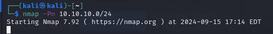

# REPORT ON PENERATION TESTING

#### Table of Contents 

#### Table of Contents 

#### Executive Summary 

#### Analysis of Overall Security Posture

#### Key Recommendation

#### Testing Methodology 
#### Summary of Findings

For:VITUAL INFOSEC AFRICA

Submitted by: 
DOMINIC KOJO KUDAWOO 

https://securetrust.io

#### Executive Summary 

 performed an internal and external penetration test of in
 scope items provided by Sample Company from 2nd september, 2024, through september 27th, 2023. 
This report describes penetration testing that represents a point-in-time snapshot of the 
network security posture of the scope in question, which can be found in the following section.

The primary objective of this testing was to assess the security posture of our internal systems, identify vulnerabilities, and evaluate the effectiveness of existing security controls.

The testing focused on critical internal assets, including servers, workstations, databases, and applications. The assessment involved both automated scanning tools and manual testing techniques to uncover potential security weaknesses.Several high-risk vulnerabilities were detected, including unpatched software, misconfigured devices, and weak password policies. Specific instances include:

Outdated operating systems with known exploits.

#### Analysis of Overall Security Posture

The overall risk to Sample Company from an internal perspective is HIGH. he internal network penetration testing conducted recently aimed to evaluate the security measures protecting our internal systems and data. This analysis provides an overview of the organization’s security posture based on the findings from the testing, highlighting strengths, weaknesses, and areas for improvement.
 The testing revealed a significant number of unpatched systems and outdated software. A lack of effective vulnerability management practices increases the risk of exploitation by attackers.
 
#### Key Recommendations: 

1. Audit and decrease user permissions across the network.
 
2.  Regularly assess and update all software and systems to address known vulnerabilities.
 
3. Prioritize patching based on the severity of vulnerabilities and potential impact.
4. Implement a systematic process for identifying, prioritizing, and remediating vulnerabilities.

### Host Discovery

 Scope
 The scope of engagement comprises of an internal network: 
name: 
https://virtualinfosecafrica.com/
 
 10.10.10.0/24 and a domain; Virtual InfoSec Africa.
 An nmap scan was performed to identify the hosts thaat were up and the potential vulnerabilities.
 
 
 
 If the hosts appear to be down even when they're up, the following comman can be used to identify them.
 
 

 The services discovered was sorted out using the following grep command.

 

 The hosts and services discovered was sorted into a .txt file using;
 
 

  
 
  
 
 
 
 
 
